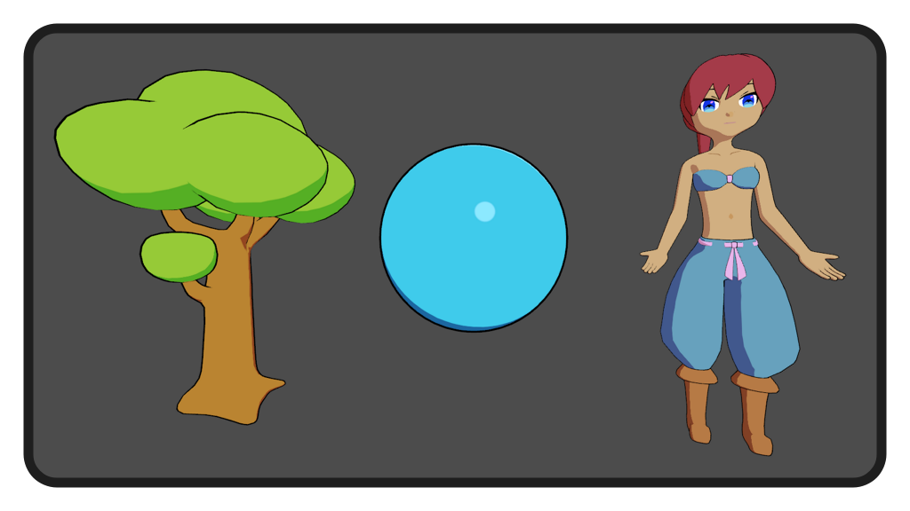

## Godot 3.2 Cel Shader v2.0.0
#### By David Lipps aka Dave the Dev at EXPWorlds

---

---

This is a demonstration project showcasing the included Cel Shader. All the assets were made by me, feel free to use them. Have fun!

  If this project helped you out, consider sending some coffee my way so I can stay locked in "the zone" and bring the Godot community more cool free stuff.

Companion YouTube Tutorial (for version 1.0.0): [https://youtu.be/laastFVkTaA](https://youtu.be/laastFVkTaA)

**New with v2.0.0:**
- Texture objects with base color and shade color textures.
- Shadows can cast on objects in the shade color.
- Applying light color and intensity works more like one would intuitively expect.
- Outline shader included.

**Cel Shader Parameter Discriptions:**
- Use Shade: Turns shading on or off. (not sure why, but you can)
- Use Specular: Turns specular highlights on or off. Specular makes things look shiney or glossy.
- Use Rim: Turns rim highlights on or off. Rim lighting highlights the edges of an object in direction of a light source.
- Use Light: The light color and intensity multiplies with the Diffuse output.
- Use Shadow: Shadows are cast on the object in the shade color. Shadow quality may depend on various settings (see Godot Documentation).
- Base Color: The normal color of the material when there is no shade or highlights. Multiplies with the base texture color.
- Shade Color: The color of the material when angle between the light and the surface nomal exceeds the shade threshold (aka the color on the object where there is no light). Multiplies with the shade texture color.
- Specular Tint: The color that gets added to the base color where there is a specular highlight.
- Rim Tint: The color that gets added to the base color where there is a rim highlight.
- Shade Treshold: The value which represents the angle between the light and surface normal at which the transistion between base color and shade color occurs.
- Shade Softness: A value which increases or decreases the gradiant amount at the transition between the base and shade colors.
- Specular Glossiness: The power multiplier controlling the amount of specular highlight. (Higher values equal smaller highlights)
- Specular Threshold: The specular value cutoff used as a base in the smoothstep function. (Best to keep at 0.5 and control specular size via the Glossiness) 
- Specular Softness: A value which increases or decreases the gradiant amount at the transition between the base and specular highlight tinted color.
- Rim Threshold: A value which controls the threshold angle between the light source, camera angle, and the edge of an object. (aka the higher the value, the more the rim highlight will spread from the edge of the object)
- Rim Spread: A value that deattenuates the spread of rim highlight around the edge of an object. (aka the higher the value, the more the rim highlight will spread around the edge of an object.)
- Rim Softness: A value which increases or decreases the gradiant amount at the transition between the base and rim highlight tinted color.
- Shadow Threshold: A value which controls the cutoff value for shadows. The higher the value, the more a shadow will cast.
- Shadow Softness: A value which increases or decreases the gradiant amount at the transition between the base and shadow colors.
- Base Texture: A texture which will be visible in areas of an object calculated to be lit by a light source. Multiplies with the Base Color.
- Shade Texture: A texture which will be visible in areas of an object calculated to be shaded (in darkness or shadow). Multiplies with the Shade Color.

**Outline Shader Parameter Discriptions:**
- Outline Thinkness: The thickness of the object's outline.
- Outline Color: The unshaded color of the object's outline.

**Additional Notes:**
- The outlines were made using the inverted hull method in Blender and/or the included outline shader.
- To use the outline shader in combination with the cel shader, place it in the next pass after the cel shader.
- It is probably best to use only one directional light, or things will start to look odd. If you need many lights in your scene, make sure cel shaded objects are only affected by one directional light by means of groups and visual layers. 
- A lot of the ideas behind the way this shader works was inspired by Junya C Motomura's 2015 GDC talk linked [here](https://www.youtube.com/watch?v=yhGjCzxJV3E&t=981s) and this article by RoyStan linked [here](https://roystan.net/articles/toon-shader.html).

I can be reached at: davidlipps.dev@gmail.com
I'd love to hear your thoughts. Especially about how I can improve. I'll do my best to get back to you.